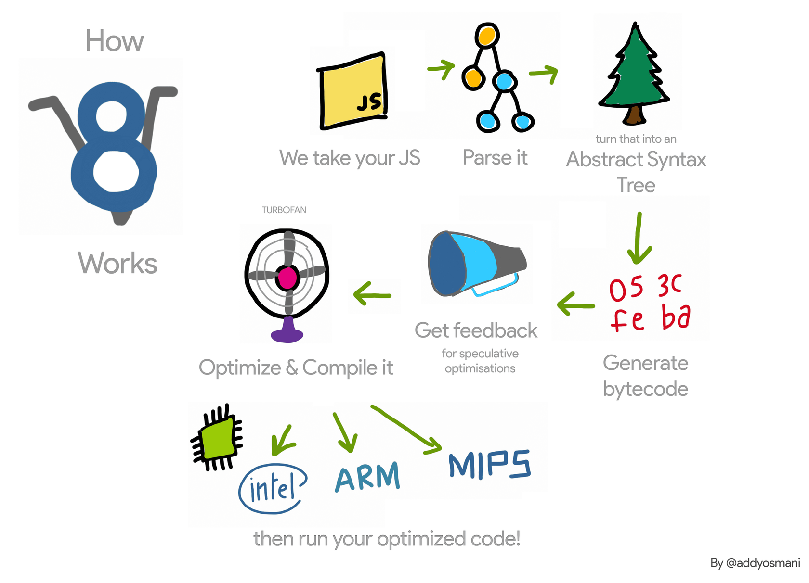
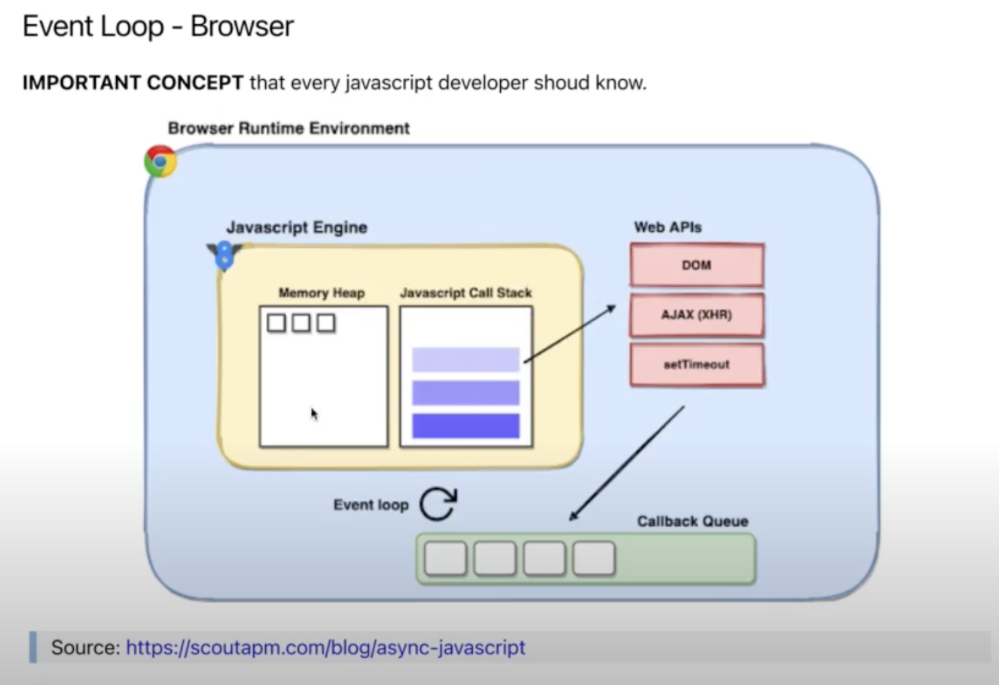
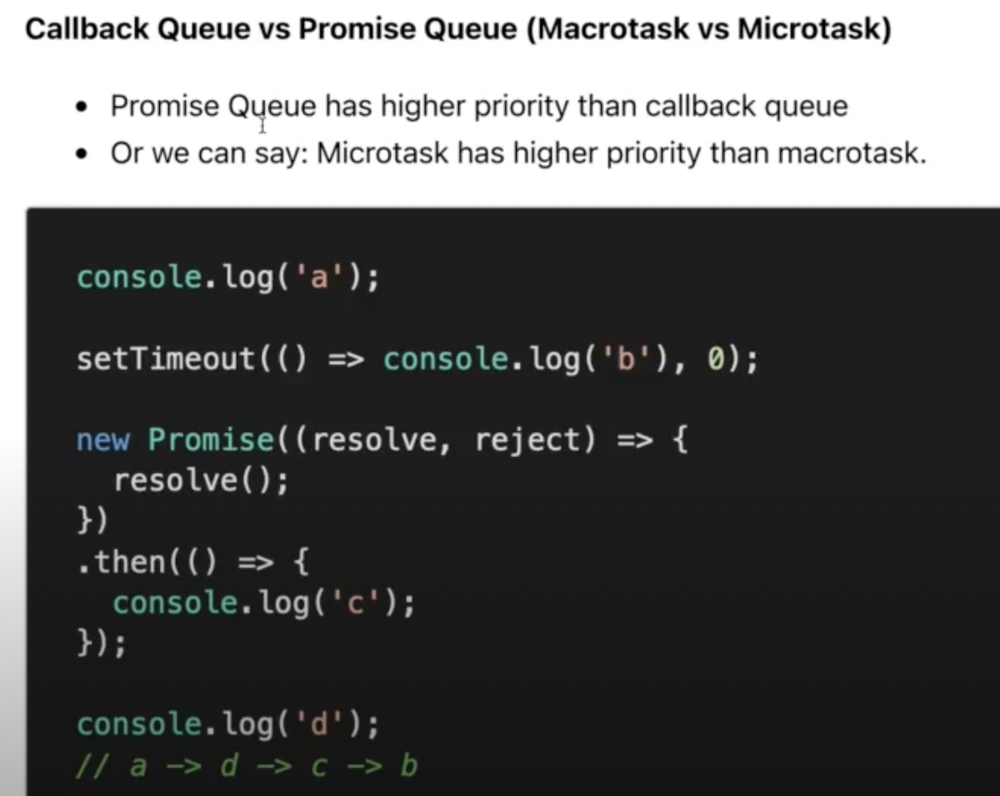

# Event Loop

> ## Overview

[The Javascript Event Loop: Explained](https://towardsdev.com/event-loop-in-javascript-672c07618dc9) cái này có hình gif demo siêu trực quan

[Jake Archibald: In The Loop - JSConf.Asia](https://towardsdev.com/event-loop-in-javascript-672c07618dc9) cái này là đỉnh của đỉnh của việc giải thích haha

1. ### **Javascript Engine**

- Hiểu nôm na là 1 chương trình của máy tính giúp thực thi được code javascript

2. ### **Event Loop**

source: https://scoutapm.com/blog/async-javascript

- **Memory Heap**: Vùng nhớ để lưu các reference variable như object, array, function. Còn các dạng static memory như boolean, string, number... sẽ được lưu trên dạng stack
  source: https://felixgerschau.com/javascript-memory-management/

    
     
     

- **_Flow hoạt động:_** https://www.jsv9000.app/ || http://latentflip.com/loupe

  - Mỗi lần gọi 1 hàm, hàm đó sẽ được PUSH vào **_"Call Stack"_**
  - Khi hàm đó executed xong --> nó sẽ được POP ra khỏi **_"Call Stack" (LIFO)_**

  - Nếu trong quá trình executed các hàm mà nó gặp một số hàm thuộc **_"Web APIs"_** ---> nó sẽ đẩy qua bên **_"Web APIs"_** xử lý
  - Sau khi **_"Web APIs"_** xử lý xong và có những **_callback_** cần phải executed, nó sẽ lấy những **_callback_** đưa vô **_"Callback Queue" (FIFO)_** và đợi ngày được lên Call

  - **_"Event Loop"_** sẽ run liên tục, đến khi nó thấy **_"Stack/ Call Stack"_** này nó **empty**

  - **_"Call Stack"_** này empty khi và chỉ khi code đồng bộ của script hiện tại được thực thi hết ---> lúc đó **_"Call Stack"_** mới **empty**

  - Lúc này **_"Event Loop"_** thấy **_"Call Stack"_** đã **empty**, nó sẽ lấy **callback đầu tiên** trong **_"Callback Queue"_** --> đẩy lên **_"Call Stack"_** để thực thi

  - Và khi executed xong --> **_"Call Stack"_** lại **empty** thì **_"Event Loop"_** lại tiếp tục --> lấy **callback đầu tiên** trong **_"Callback Queue"_** --> đẩy lên **_"Call Stack"_**.
     
     
     

3. ### **Callback Queue vs Promise Queue - (Macrotask vs Microtask):**

   

- Microtask (Promise Queue) có độ ưu tiên cao hơn Callback Queue

- Microtask có độ ưu tiên > Macrotask
