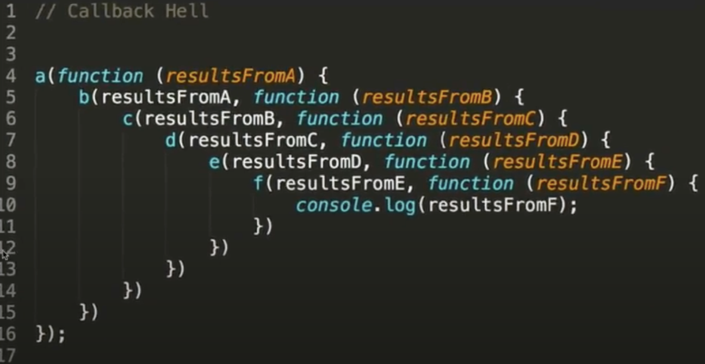
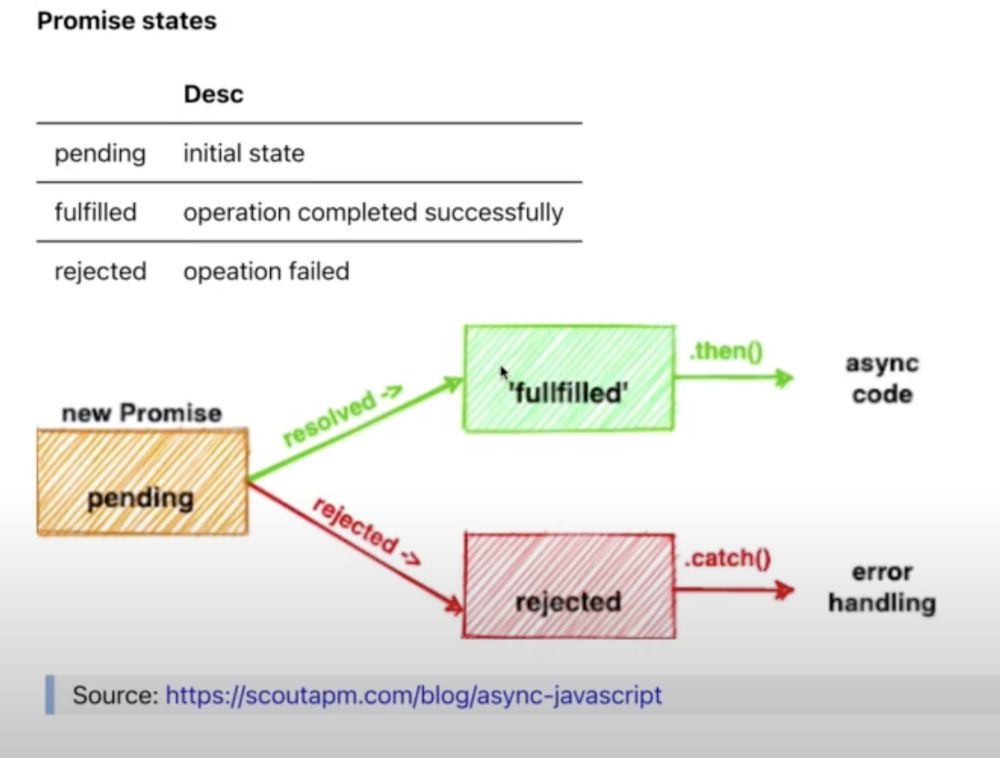
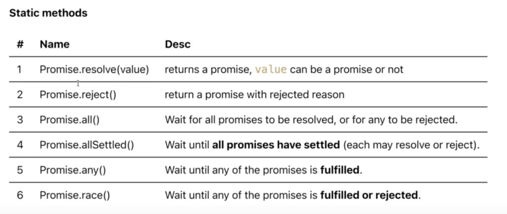
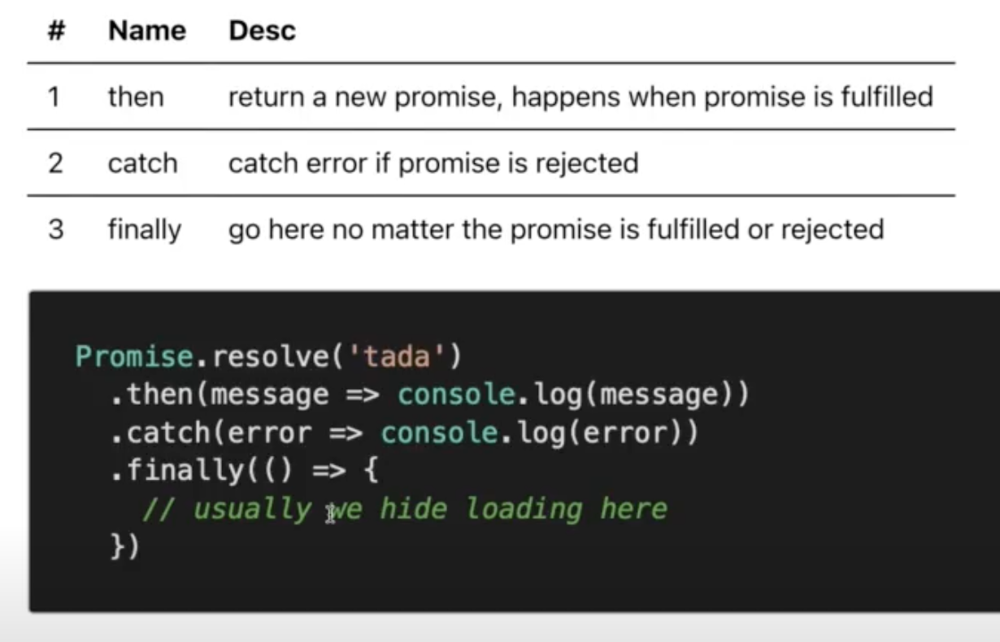
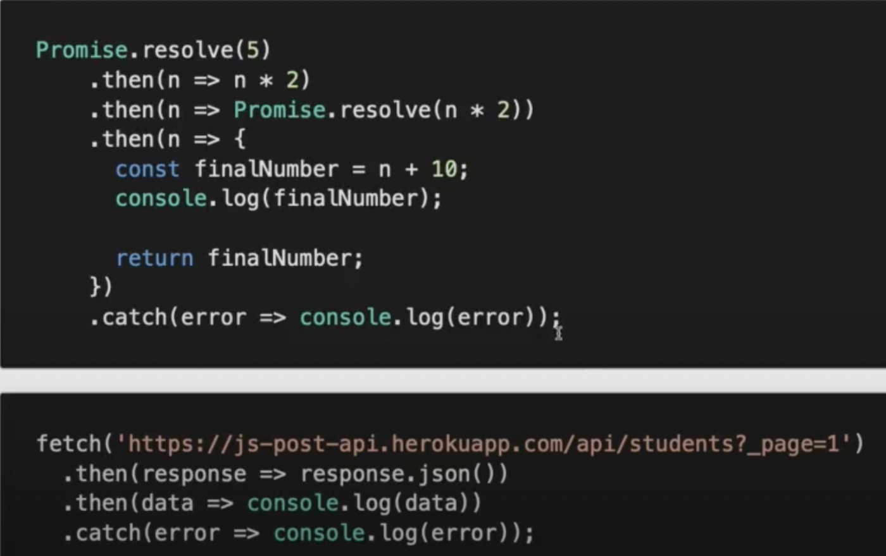

# Promise

> ## Overview

Source: [Learn promise-async-await](https://www.freecodecamp.org/news/learn-promise-async-await-in-20-minutes/)

1. ### **Callback hell:**

2. ### **Promise states:**

3. ### **Static methods:**

4. ### **Promise chaining:** giải quyết câu chuyện **_Callback hell_**

