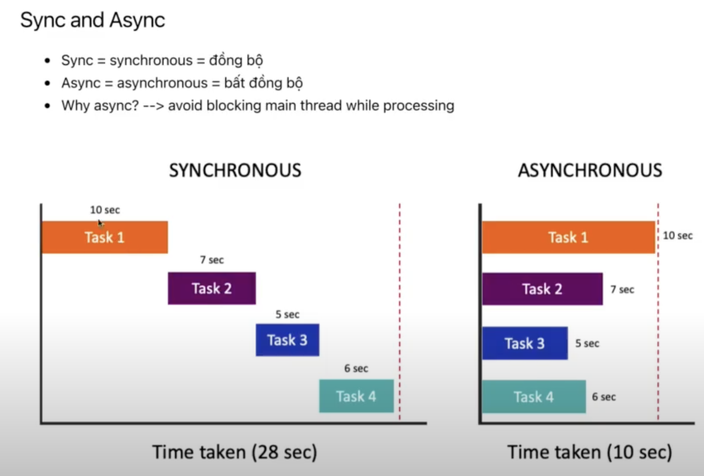
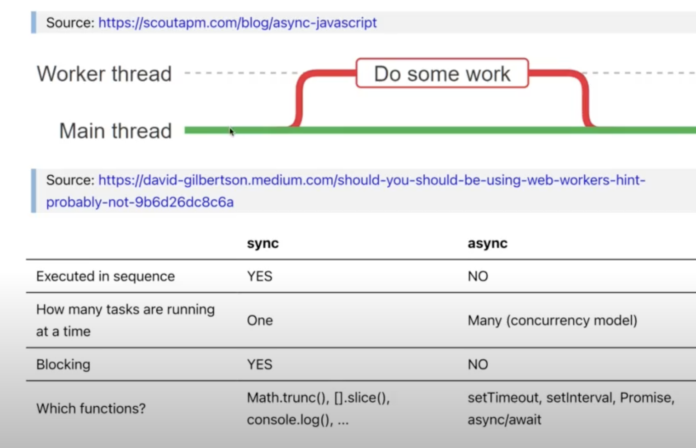

# Async Concepts

> ## Overview

- ### **Note:**
  - Sự khác biệt giữa **setInterval()** và **setTimeout()** là setInterval cứ đúng n(ms) sẽ thực thi tiếp, còn **nested setTimeout** là sau khi thực thi xong thì sẽ chờ n(ms) mới thực thi tiếp
