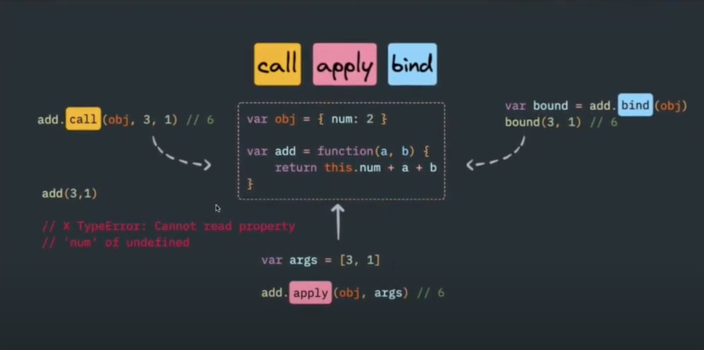

# Javascript Fundamental

> ## Bind - Call - Apply

- Trong **_normal function_**, tuỳ vào cách **_normal function_** được sử dụng thì **_this_** sẽ có giá trị khác nhau ---> thông qua các hàm **_bind(), call(), apply()_** giúp chỉ định được **"this"** cho 1 function nào đó

- It just works in regular function, vì arrow function không có **"this"** riêng của nó, nó chỉ kế thừa lại **"this"** của thằng cha nó
