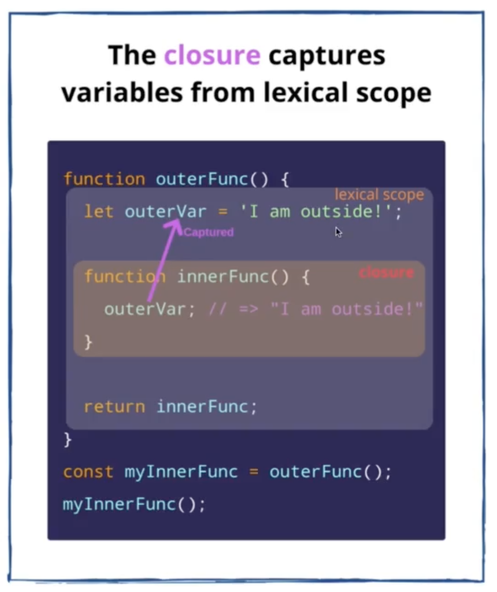
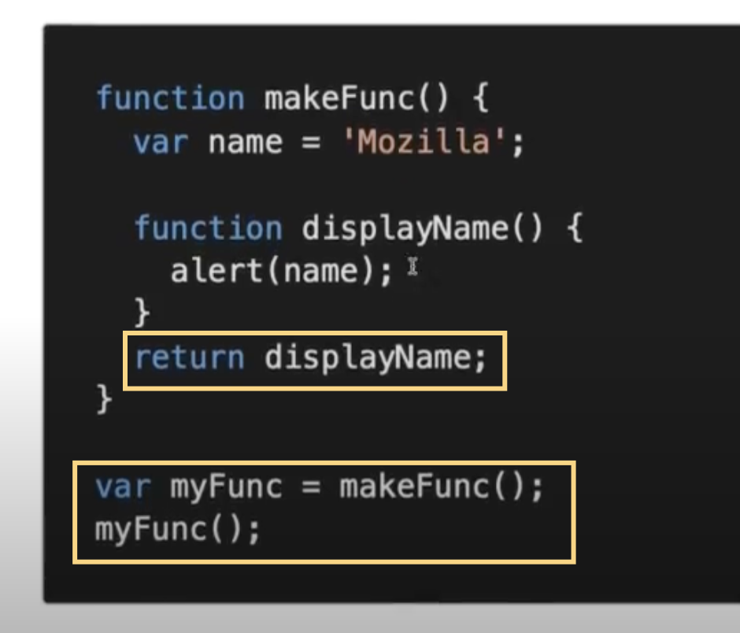

# Javascript Fundamental

> ## Closures

- A Closure is a **function** is having **access to the parent scope**, **even after** the **parent function** has **closed**:
  - https://dmitripavlutin.com/simple-explanation-of-javascript-closures/

- Hàm makeFunc() return về một hàm là displayName
- Hàm makeFunc() đã chạy và được gán vào biến myFunc
- Sau đấy biến myFunc() mới chạy, nhưng hàm displayName() vẫn là một closure mặc đù parent function đã closed
