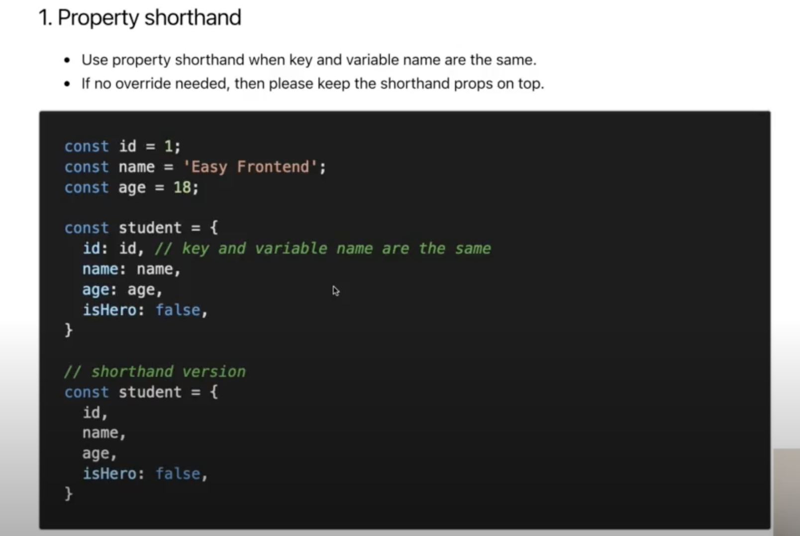
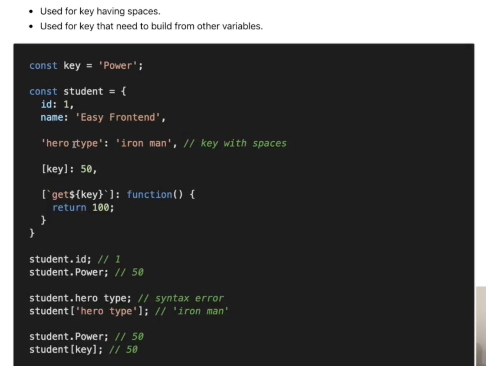
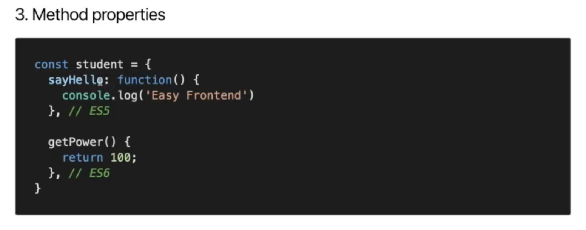
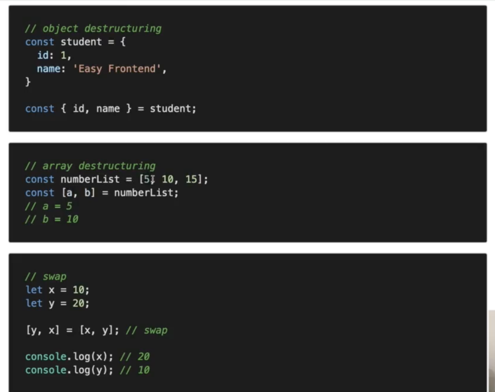
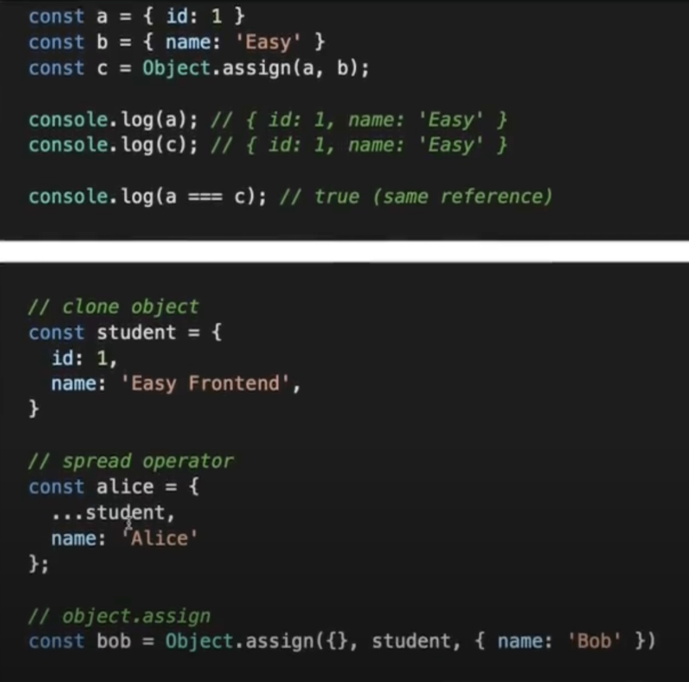

# Javascript Fundamental

> ## Enhanced Object Properties

1. ### **Property shorthand:**

2. ### **Computed Property Name:**

3. ### **Method Property:**

4. ### **Destructuring:**

5. ### **Object assign:**

