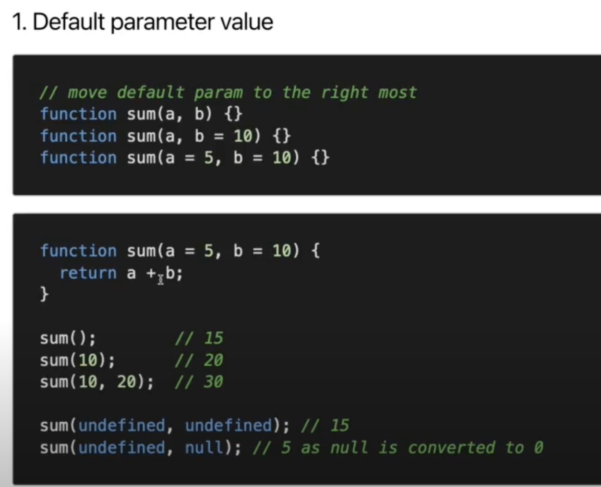

# Javascript Fundamental

> ## Function

1. ### **Default parameter value:**

2. ### **Rest parameter:** Gom 1 danh sách về 1 cái **_[vd: file index](./index.js)_**

- ### Note: **arguments** object is an Array-like object, not Array (ES5)
- ### **Rest parameter in ES6:**

3. ### **Spread parameter:** Ngược lại với Rest, Spread tách 1 cái ra một danh sách **_[vd: file index](./index.js)_**

4. ### **Arrow function:**

5. ### **Constructor function:**

6. ### **Curry function / Higher Order Function (HOF):**

- Là 1 function return về 1 function khác **_[vd: file index](./index.js)_**
