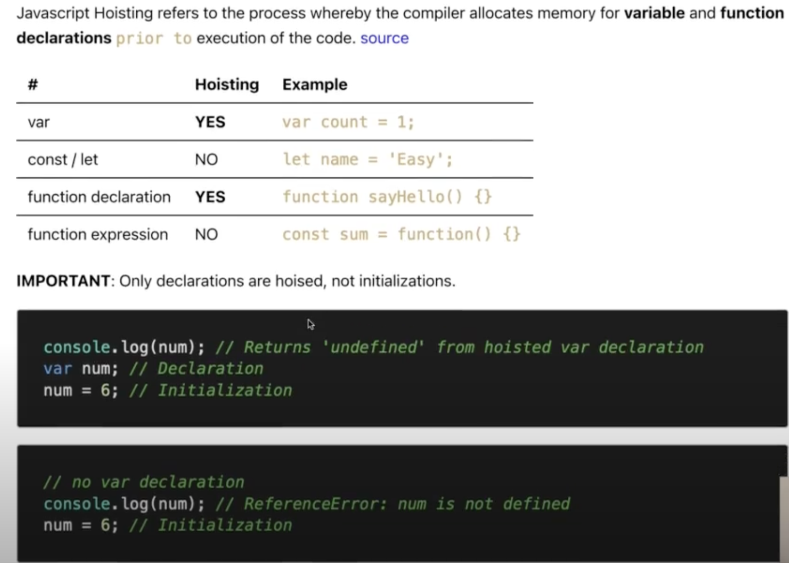
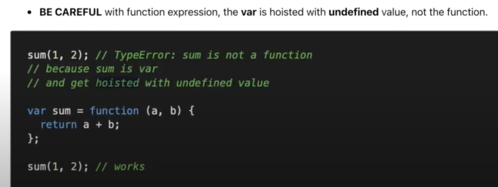
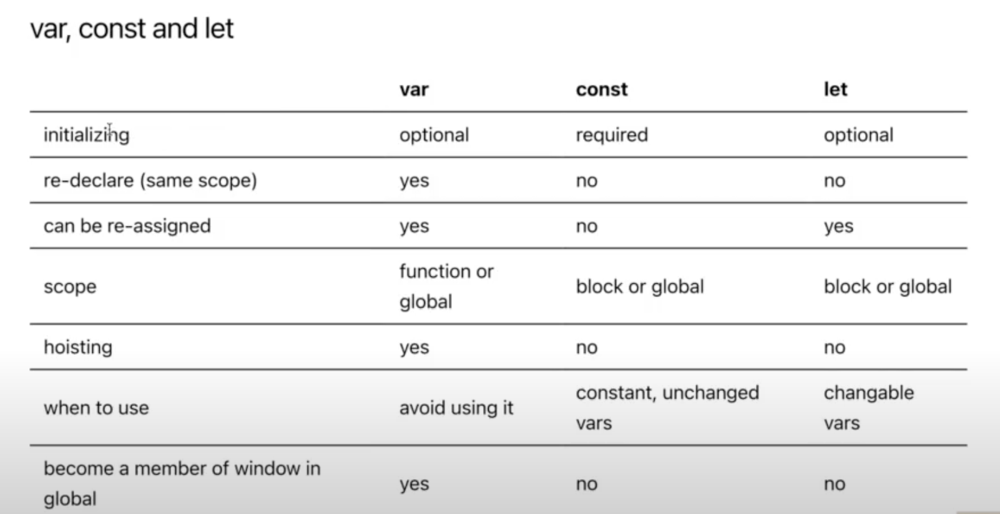

# Javascript Fundamental

> ## Hoisting:

- ### **Định nghĩa**: Là quá trình **compiler** cấp bộ nhớ cho **variable** và **functional decleration** **_trước khi_** thực thi code (sử dụng được biến đó hay hàm đó khi chưa đến dòng khai báo)



- ### **Function declaration\***:

  - Able to use function before the declaration:

  ```
  sum(1, 2) // also works

  function sum(a, b) {
      return a + b
  }
  sum(1, 2) // works
  ```





> Bản chất bên dưới thì thật ra const/let cũng bị hoisting, NHƯNG nó add thêm một khái niệm **_Temporal Dead Zone_** để check và phát hiện việc sử dụng biến const/let trước khi khai báo thì nó sẽ báo lỗi.

> Nên cẩn thận khi bị hỏi lách léo, const/let có bị hoisting ko?

> Trả lời: CÓ, nhưng kèm theo **_Temporal Dead Zone_** (ko dùng được trước dòng khai báo)

- Trích từ MDN: "The variable is said to be in a "temporal dead zone" (TDZ) from the start of the block until the initialization has completed."

- Tham khảo thêm tại:

  - MDN: https://developer.mozilla.org/en-US/docs/Web/JavaScript/Reference/Statements/let#temporal_dead_zone_tdz

  - FreeCodeCamp: https://www.freecodecamp.org/news/what-is-the-temporal-dead-zone/
