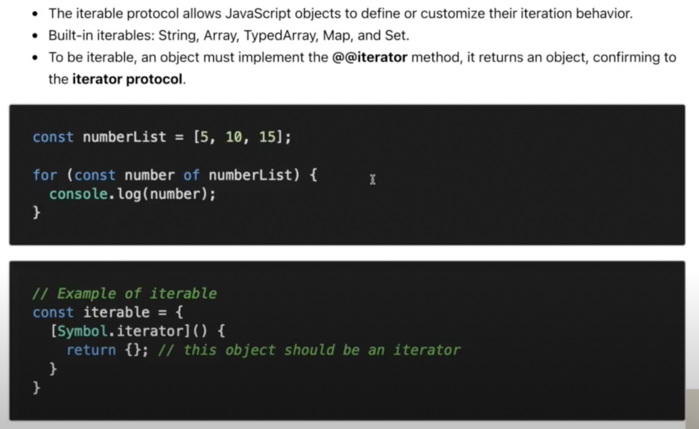
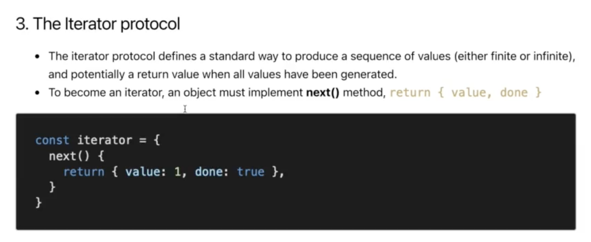

# Javascript Fundamental

> ## Iteration protocol

- Là một giao thức để lặp, duyệt qua các phần từ trong chuỗi, một danh sách nào đấy

- It **aren't** build-in syntax (cú pháp), it just a **protocol** (một giao thức - dạng tài liệu định nghĩa)

- Dùng cài đặt cho các **Object** mà mình muốn nó có được các giao thức này...

- There are two protocols: **iterable protocol** and **iterator protocol**

1. ### **Iterable protocol:**

- Như hình trên thì **numberList** có giao thức **"iterable protocol"**

2. ### **Iterator protocol:**

## **_[VD: file index.js](./index.js)_**
