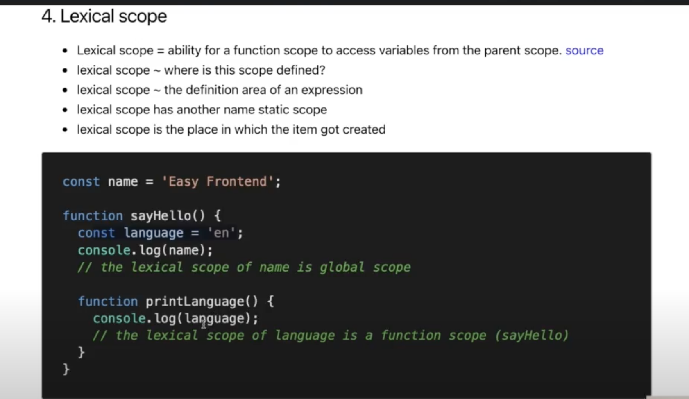
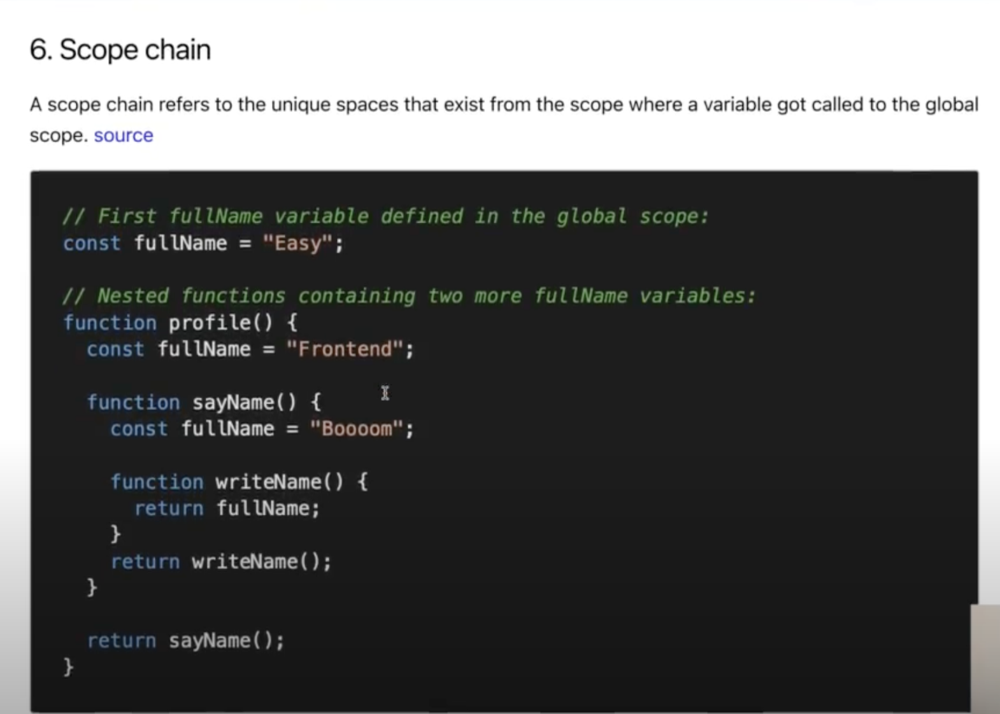
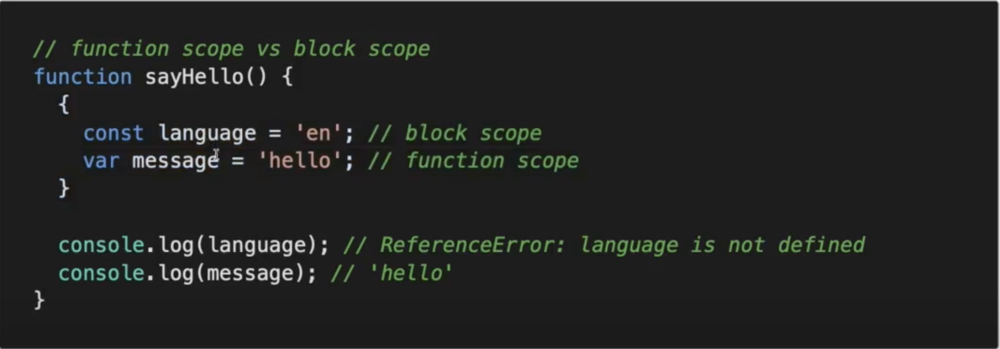

# Javascript Fundamental

> ## Scope

- Phạm vi hoạt động của 1 biến
- Có các loại scope:

  - ### **_Block scope_**:

    - Biến nằm trong cặp dấu ngoặc nhọn **{}**, có phạm vi hoạt động trong curly cặp ngoặc nhọn gần nhất
    - **const/let** has block scope (es6)

  - ### **_Functional scope_**:

    - Nằm trong phạm vi một function
    - **var** có phạm vi là function scope

  - ### **_Lexical scope_**: Where is this scope defined?

    - Nằm trong phạm vi một function
    - 

  - ### **_Global scope_**:

    - Biến không nằm trong bất kỳ hàm nào cả
    - Biến có thể được truy cập được ở khắp nơi: **_globalThis_** thay thế cho Browser (window), Nodejs (global), Woker (WorkerGlobalScope/Self)

  - ### **_Scope chain_**:

    

    - Trong hình trên biến fullName ko có trong hàm writeName() ---> nó sẽ lên trên hảm sayName() để tìm và trả về "Booooom" (nếu như hàm sayName() ko có biến fullName thì nó sẽ lên tiếp tục lên trên hàm profile() để tìm...)

> **Case Check** > 
