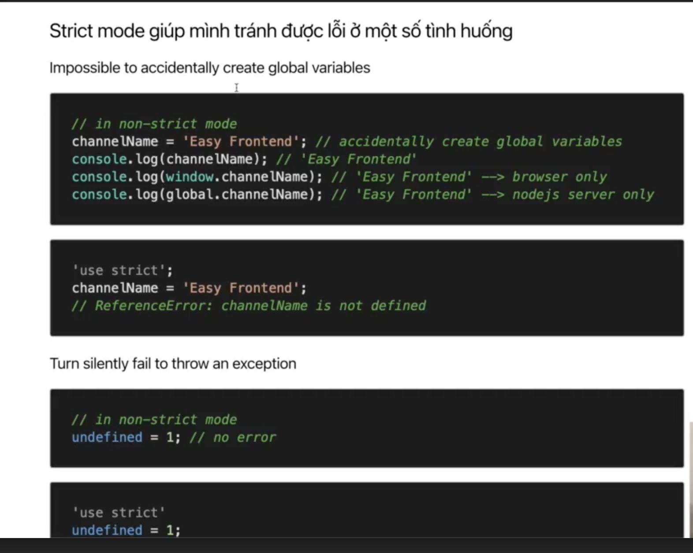

# Javascript Fundamental

> ## Strict mode

- Có từ ES5 (2009)
- Sử dụng "strict mode" thì sẽ dùng code từ ES5 về sau
- Throw các error mà trước đây các error đó ko throw ra
- Fix some bugs, giúp code chạy nhanh hơn
- Hầu như tất cả các dự hiện nay đều đã có "strict mode"
- Trường hợp dùng **“Class” || “ES6 module”** auto turn on “strict mode”
- **'use strict';** --> điền dòng này ở đầu file js để apply cho toàn file đó, để trong 1 function thì chỉ áp dụng cho function đó

