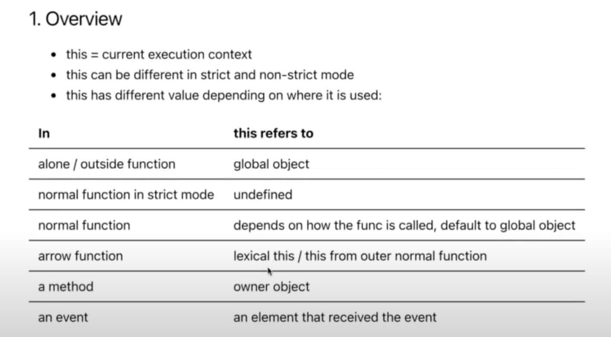
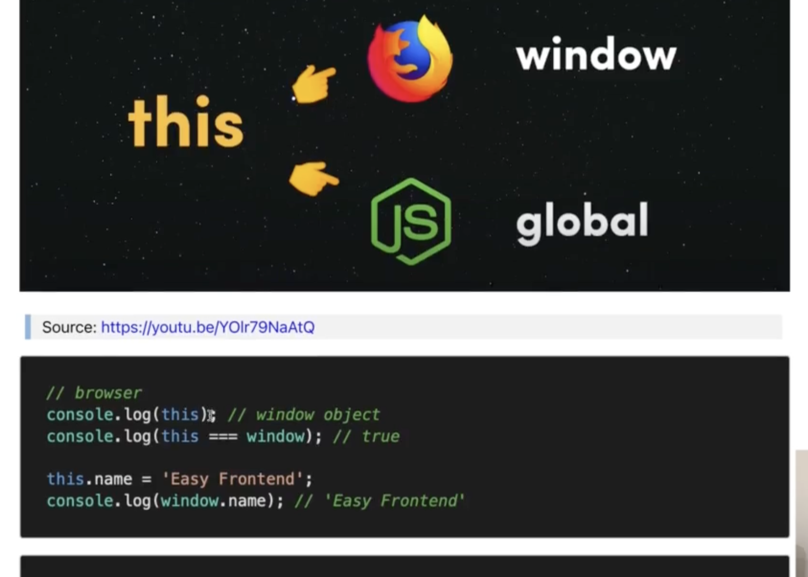
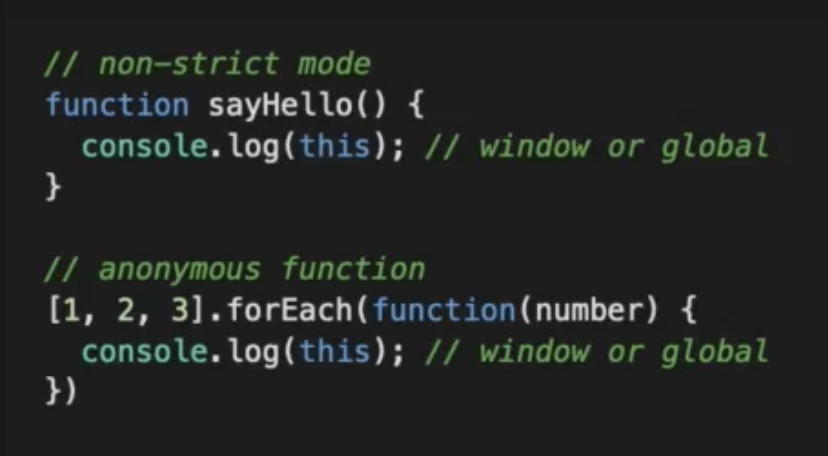
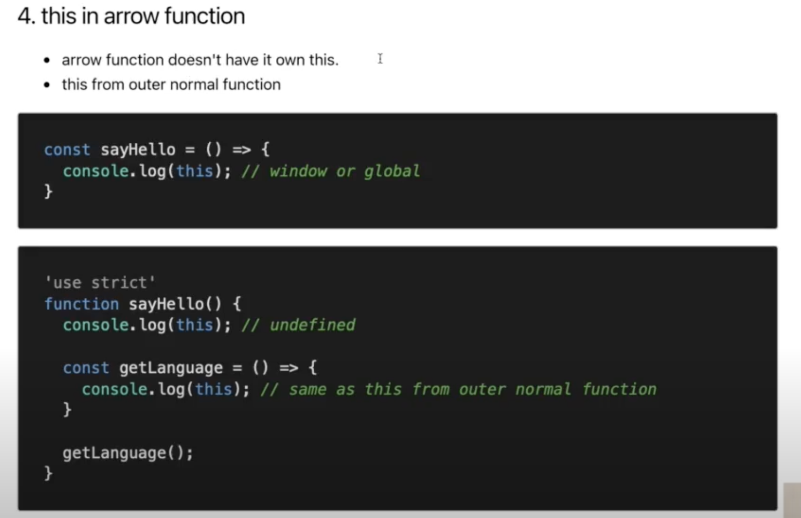
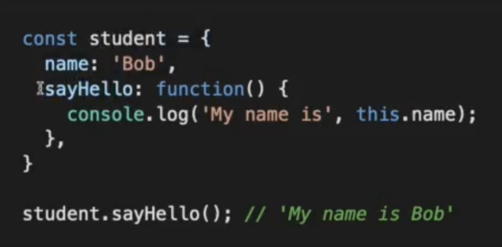

# Javascript Fundamental

> ## This

### **Overview:** **_this_** của javascript mang giá trị khác nhau tuỳ thuộc vào từng ngữ cảnh

1. ### **This in global context:**
   - This không được đặt trong bất kỳ function nào --> this đó sẽ trỏ tới globalObject

2. ### **This in normal function:**

   - Non-strict mode: 

   - Use-strict mode: ngược lại với non-strict mode thì **"this"** ở đây sẽ trả về **"undefined"**

3. ### **This in arrow function:** **_[Vd: file index.js](index.js)_**

   

4. ### **This in a method:** **_[Vd: file index.js](index.js)_**

   

   - This sẽ trỏ về object methods chủ
   - Tránh dùng arrow function trong object methods
