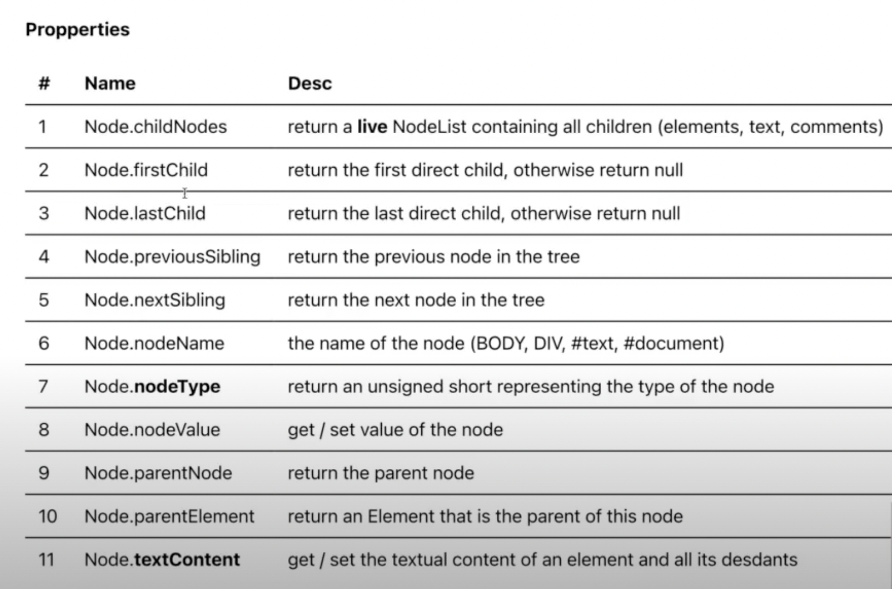

# DOMStructure

> ## Overview

- Tính kế thừa, vd Element sẽ kết thừa các hàm và thuộc tính của Node và EvenTarget

1. ### **EvenTarget interface:**

- EventTarget.addEventListener(): register an event handler of a specific event type
- EventTarget.removeEventListener(): remove an event listener

2. ### **Node interface:**

- **_Node properties_**
  

- **_Node methods_**
  
