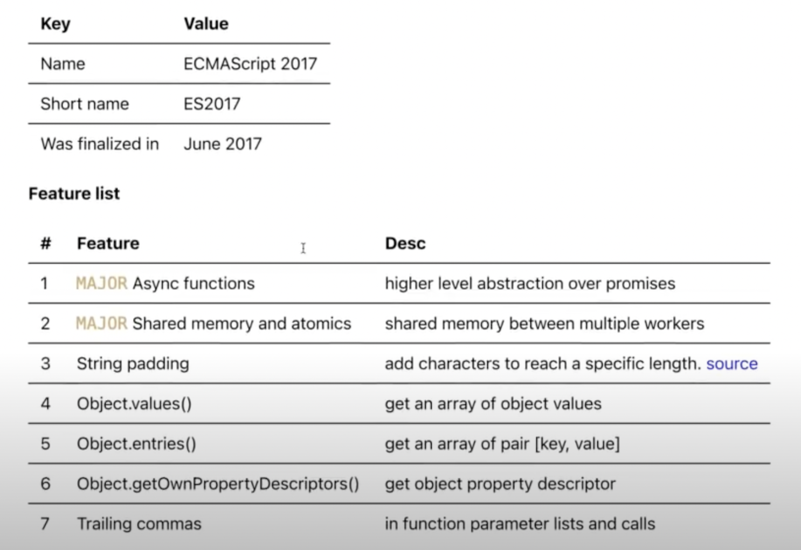
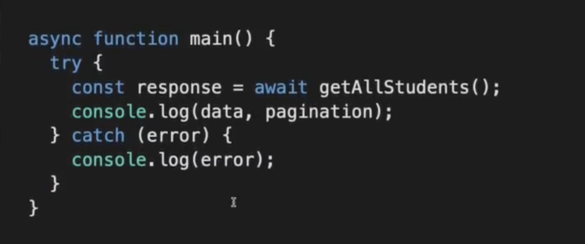
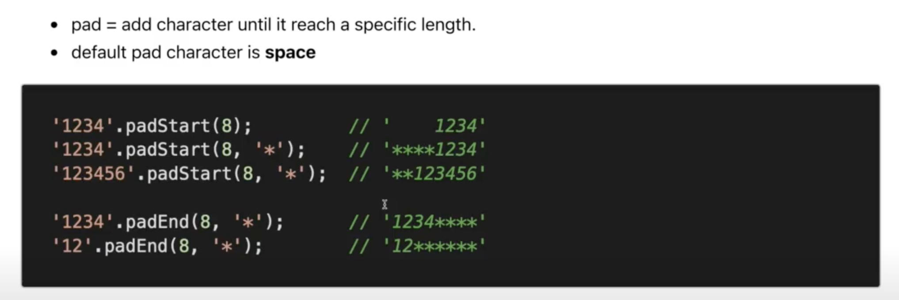
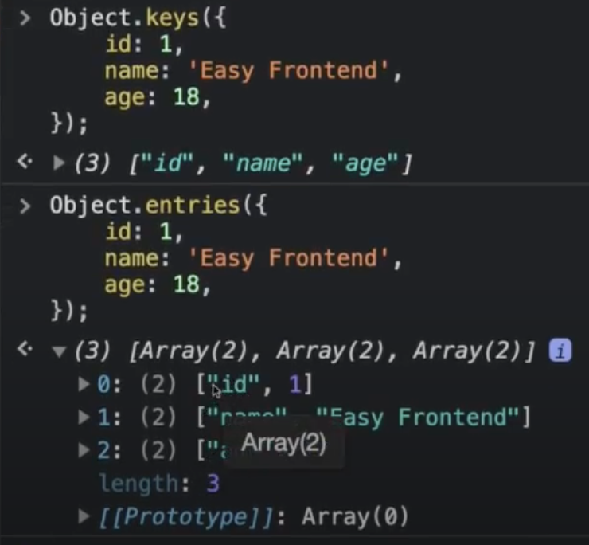
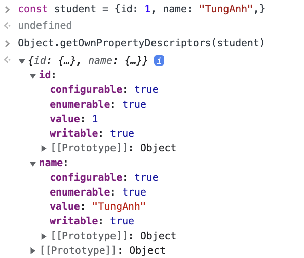

# ECMAScript 2017

> ## Overview

1. ### **ASYNC function:**

   

2. ### **Shared memory and atomics (nâng cao)**

- Since ES2017, you can **create a shared memory array** between **web workers and their creator**, using a **SharedArrayBuffer**

3. ### **String padding:**

   

4. ### **Object.values():**

   .png>)

- Lấy được 1 cái mảng các **value** của **object**

5. ### **Object.keys() and Object.entries():**

   

6. ### **Object.getOwnPropertyDescriptors():**

   

7. ### **Trailling comma**

- Thêm được dấu **","** sau cùng trong **Array**

  - [1, 2, 3, ].length // 3
  - [1, 2, 3,, ].length // 4

- Thêm được dấu phẩy ở phần tử sau cùng trong Object (from ES5)

- Thêm được dấu phẩy trong function (from ES2017)
