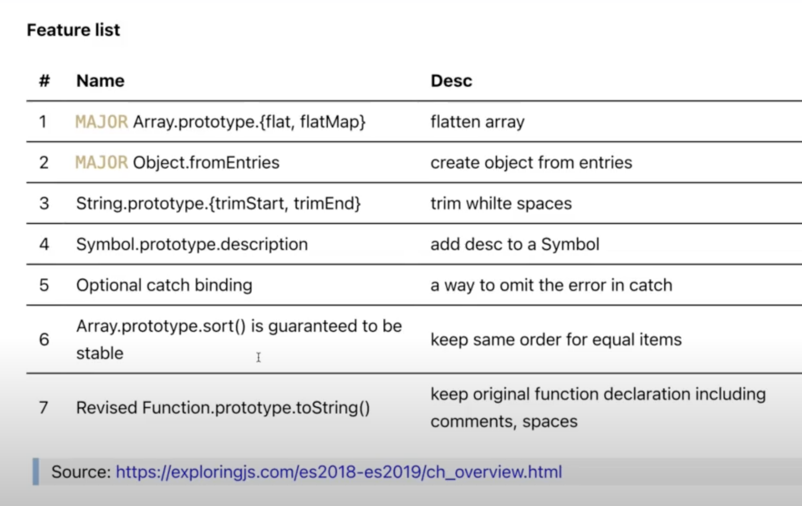
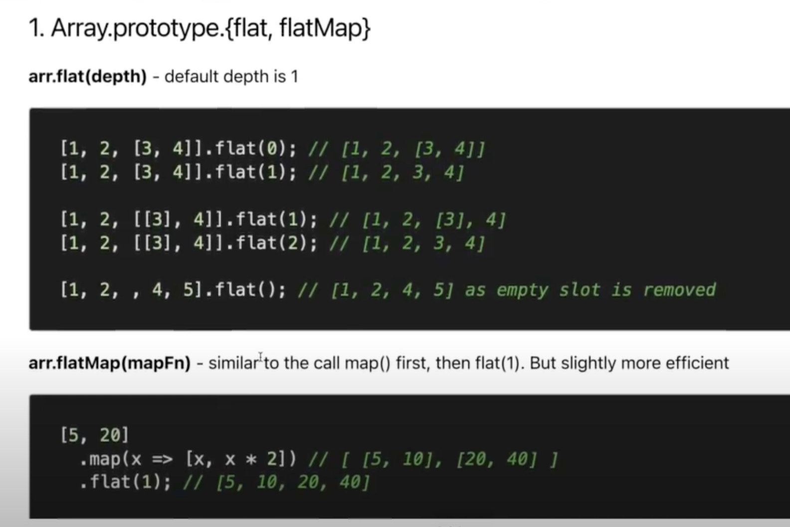
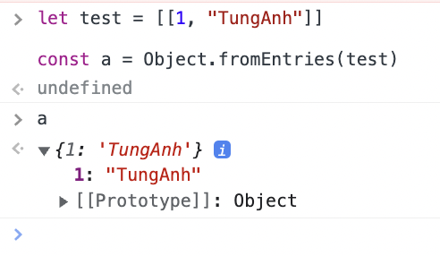
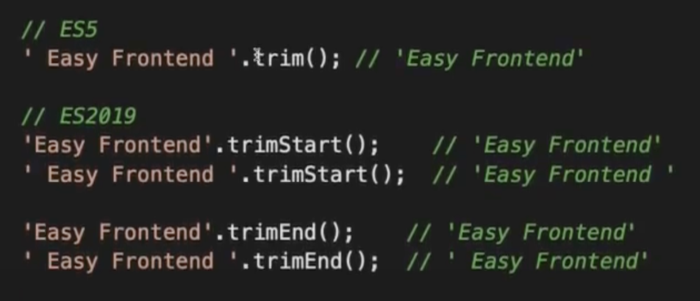
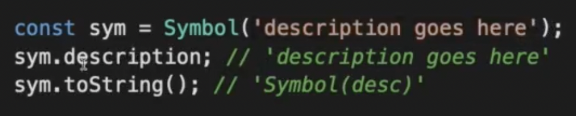
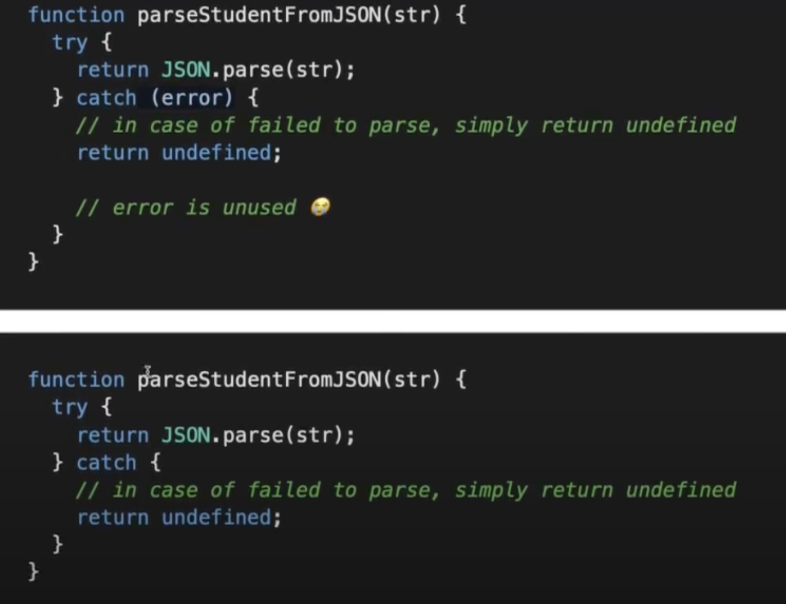

# ECMAScript 2019

> ## Overview



1. ### **Flat**



2. ### **Object.fromEntries()**



3. ### **trimStart() & trimEnd()**



4. ### **Symbol description**



5. ### **Optional catch binding**



6. ### **Array.property.sort() guranted to be stable**

- Khi sort() có 2 item === nhau thì sẽ trả về thứ tự ban đầu của Array đó, vd:
  - ```[
    {id:1, name: "B"},
    {id:2, name: "A"},
    {id:3, name: "B"}
    ] --->
    [
    {id:2, name: "A"},
    {id:1, name: "B"}, // vẫn nằm trước item có id === 3
    {id:3, name: "B"}
    ]
    ```
