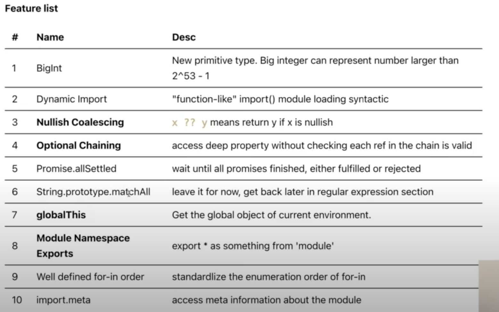
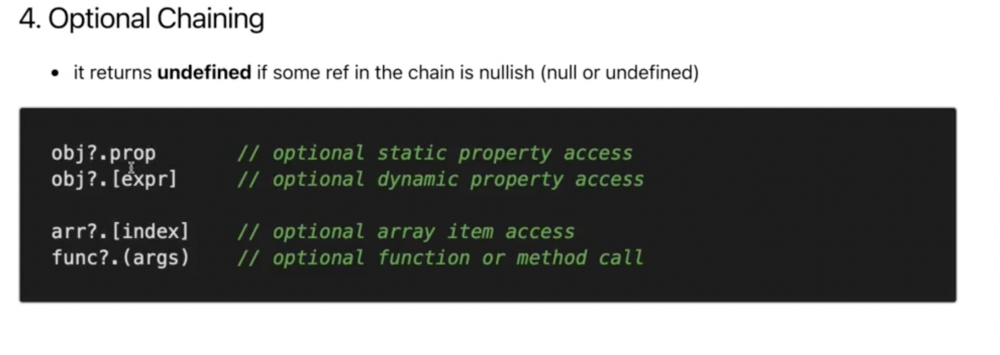

# ECMAScript 2020

> ## Overview

> ## Important

1. ### **Nullish Coalescing**

- Vd: **x ?? y**, ý nghĩa là nếu **x** có giá trị null thì sẽ lấy giá
  trị của **y**

2. ### **Optional Chaining**

